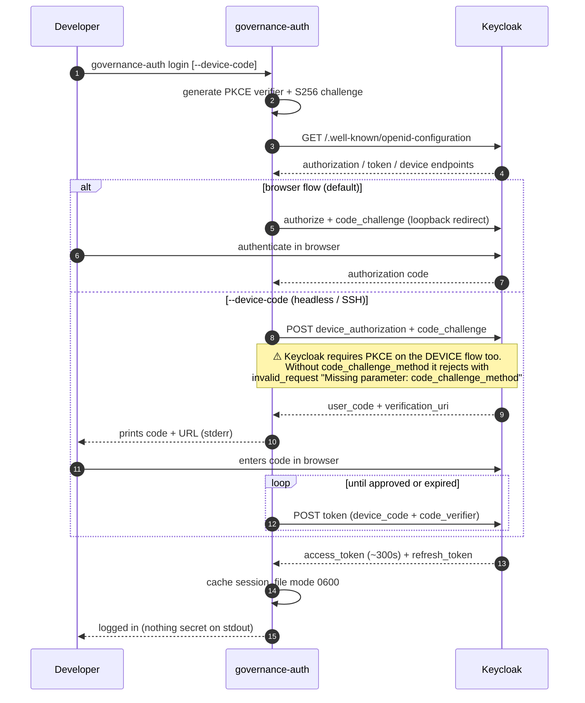
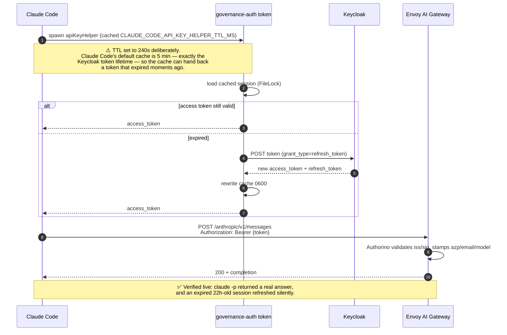
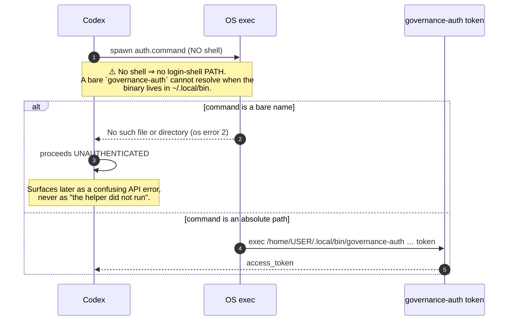
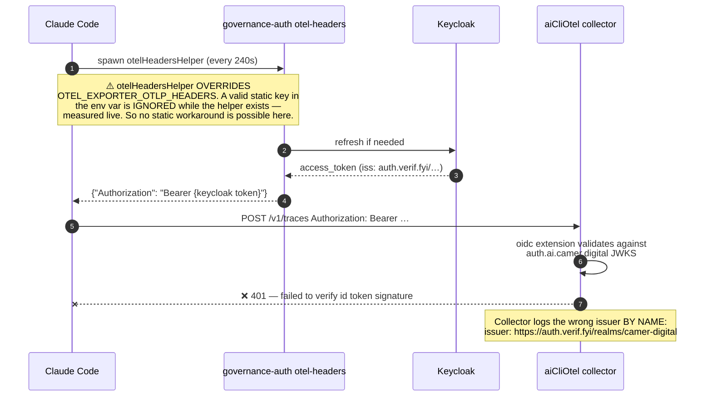
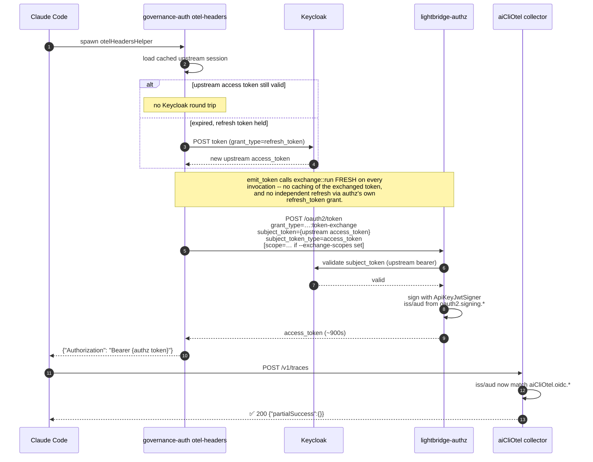
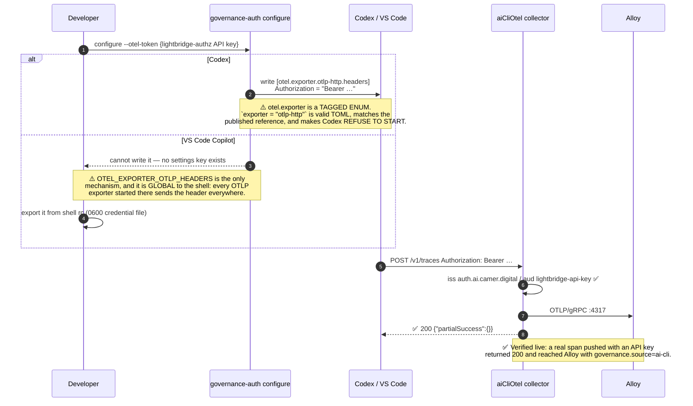
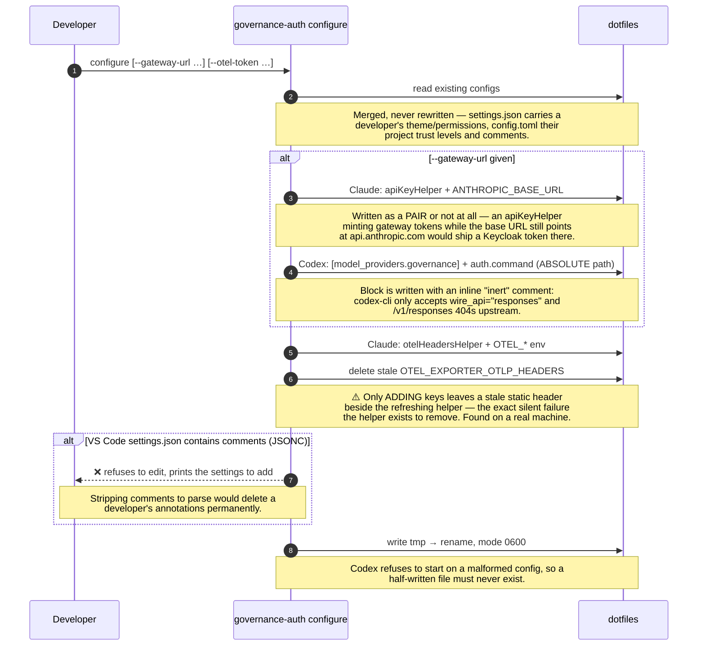
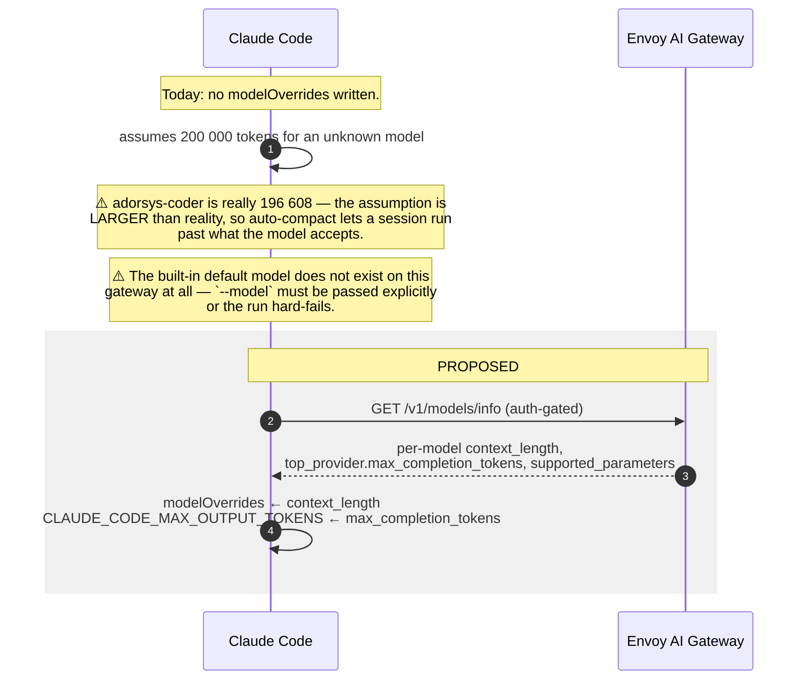
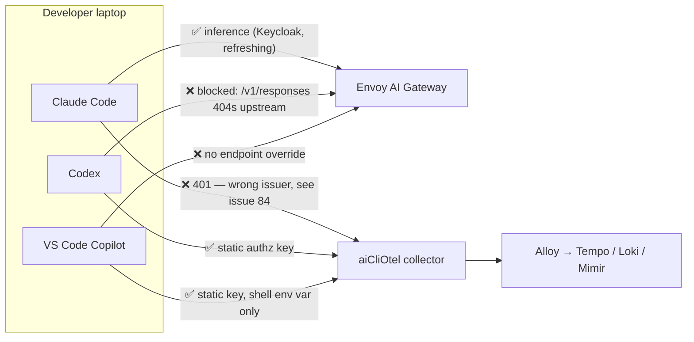

# AI client flows

One sequence diagram per row of the
[AI client support matrix](ai-client-support-matrix.md). The matrix says
*whether* a capability works per client; this says *how*, and where it breaks.

Every flow here was traced against the live system unless a diagram is marked
**PROPOSED**. Where a step is a known trap, the trap is on the diagram rather
than in prose underneath it — the diagram is meant to be readable alone.

Actors are consistent throughout:

| Actor | What it is |
|---|---|
| `CLI` | Claude Code / Codex / VS Code Copilot on a developer laptop |
| `ga` | `governance-auth`, this repo's credential helper (ADR-0010) |
| `KC` | Keycloak — `auth.verif.fyi/realms/camer-digital`, client `governance-auth-cli` |
| `authz` | lightbridge-authz — `auth.ai.camer.digital`, self-signed API-key issuer |
| `GW` | Envoy AI Gateway — `api.ai.camer.digital` |
| `OTEL` | `aiCliOtel` collector — `otel.ai.camer.digital` |
| `Alloy` | cluster OTLP fan-out → Tempo / Loki / Mimir |

---

## Login — the one interactive ceremony

Runs once per developer. Everything else is non-interactive.

---

## Inference endpoint + inference auth

Matrix rows: **Inference endpoint**, **Inference auth**.

The credential helper is re-invoked by the CLI; `governance-auth` refreshes
silently against Keycloak, so the developer logs in once.

### Codex spawns its helper differently — and that broke it

Claude Code resolves a bare name (it uses a shell), so this trap is invisible
if only that client is tested. `governance-auth` now builds every command it
writes from `otel::binary_path()` (`std::env::current_exe()`).

---

## Telemetry endpoint + telemetry auth (refreshing)

Matrix rows: **Telemetry endpoint**, **Telemetry auth, refreshing**.

This is the path that is **currently broken** — see
[#84](https://github.com/ADORSYS-GIS/lightbridge-governance/issues/84).

### Token exchange (RFC 8693, opt-in) — the same flow once `--token-exchange` is on

Ships in `governance-auth` behind `--token-exchange`/`GOVERNANCE_AUTH_TOKEN_EXCHANGE`
(OFF by default). See `oauth::exchange`'s module doc and `oauth::mod::emit_token`
for the source of truth this diagram is traced from — read those, not this
diagram, if the two ever disagree.

Why this works with **no collector change**: the exchange is signed by the
same `ApiKeyJwtSigner` that mints today's API keys, and a token with
`iss: auth.ai.camer.digital` / `aud: lightbridge-api-key` is already verified
to return 200 from this collector.

What `governance-auth` sends on the exchange request, and what it doesn't:

- **No `project_id`.** Required by this deployment until upstream PR #309
  merged; now optional, so the exchange resolves to the subject's own
  auto-provisioned default project. There is no `--exchange-project-id` flag
  — adding one would just reintroduce a required field the server itself
  dropped.
- **No `audience`/`resource`.** This deployment's exchange handler never
  reads it — the minted token's `aud`/`azp` are always exactly the
  requesting `client_id` regardless of what's sent, so a config knob for it
  would silently do nothing.
- **No caching, no independent refresh.** `emit_token` calls `exchange::run`
  fresh on every `token`/`otel-headers` invocation when exchange is on —
  there is no cached exchanged token with its own expiry, and no separate
  `refresh_token` grant against authz. Each invocation re-derives the
  exchanged token from the CURRENT upstream (Keycloak) access token,
  refreshing that upstream token first only if it's stale (the same
  `current_session` refresh cycle every other flow already uses). The 240s
  `otelHeadersHelper` debounce is what bounds the request rate against
  authz, not caching.

---

## Telemetry auth (static)

Matrix row: **Telemetry auth, static**. This is the path that **works today**.

Fail-closed behaviour, also verified live: an unauthenticated POST returns
**401**, and a malformed bearer token returns **401**.

---

## Written by `governance-auth configure`

Matrix row: **Written by `governance-auth configure`**.

---

## Model context windows

Matrix row: **Model context windows**. **Not yet wired** — this is the
intended shape, not current behaviour.

Reading the window from the gateway is the point: hard-coding it into a
binary would silently rot as models change. opencode already consumes this
endpoint (`meta.modelsInfoUrl`), so it would be one source of truth, not two.

---

## Config file safely mergeable

Matrix row: **Config file is safely mergeable**. Covered by the `configure`
diagram above — the JSONC refusal branch and the tmp→rename write are the
whole mechanism.

---

## End-to-end: where each client actually stands

The asymmetry is the thing to remember: **Claude Code is the only client whose
telemetry is broken, and the only one whose inference works.**
