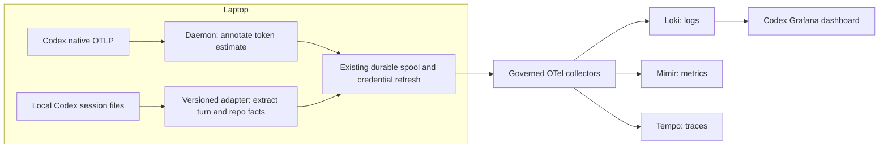
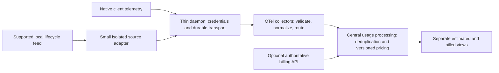

# Dashboard direction and implementation handoff

Status: 2026-09-12. This document records the agreed product direction, the Codex
implementation, and the work remaining for Claude Code and VS Code Copilot.
It distinguishes shipped implementation from recommendations; it is not an ADR
approving a permanent location for pricing or private-format parsers.

## Agreed dashboard ownership

| Dashboard | Owns | Does not repeat |
|---|---|---|
| AI CLI / Governance overview | Navigation to source dashboards and bounded collection-presence indicators | Source usage, tokens, spend, models, tools or user tables |
| Codex | Codex user/session activity and supported measurements | Overview health and another client's activity |
| Claude Code | Claude user/session activity and supported measurements | Overview health and another client's activity |
| VS Code Copilot | Editor/agent telemetry from VS Code Copilot | GitHub organization's reports or seat administration |
| GitHub Copilot reports | GitHub reporting API aggregates and seats at their actual reporting grain | Editor session telemetry inferred from those aggregates |
| OpenCode | OpenCode-specific telemetry | Other clients' usage |

Use one owner for each question. Within a source view, a selected user's total
and the sessions contributing to it are useful summary/drilldown, not separate
copies of the same overview. Keep diagnostic events out of the default activity
trend. Link to existing diagnostic tools rather than rebuilding them everywhere.

Most employees use the same email for the AI client and governance login. The
pilot user's different emails are an exception. Do not require account changes
or silently equate those identities. Current Codex filters use the native Codex
email; metadata correlates through the source session ID. This is reporting
correlation, not an identity-verification or authorization boundary.

## Measurement and display agreement

Show only measurements supported by verified source data. Unknown is not zero.
All usage panels follow the selected user/session and time range; explicitly
label the few intentionally fleet-wide coverage indicators.

| Question | Display | Meaning and coverage requirement |
|---|---|---|
| How many sessions? | Number; session table underneath | Distinct source session IDs, with resumed sessions deduplicated |
| How much money? | Currency total and per-session currency column | IDE-derived estimate and authoritative billed cost are separate measures; dashboards must work without admin billing access |
| How long? | Duration column per session; turn detail if available | Distinguish observed first/last activity, elapsed agent turns and human active time; never relabel one as another |
| How much code? | Separate numbers for proposed, accepted and retained additions/deletions | Applied can be an additional distinct measure. Permission approval is not human edit acceptance. Define retention checkpoint and coverage before displaying |
| Activity over time? | Line chart of meaningful event counts per interval | Prompts, model calls/responses, tool calls; diagnostic events optional |
| Which models? | Separate model-share pies/donuts | Explicit denominator: responses, tokens, or supported cost; no mixed units |
| Waiting time? | Median/p95 numbers and compact trends | Separate turn-to-first-token from request-to-first-token populations |
| Acceptance/rework? | Summary numbers and concise breakdown table | Only independently observed edit outcomes; no proxy from automated tool approvals |
| Which projects/repositories? | Ranked table | Attribute only supported sessions/turns/tokens/cost; unknown visible, no full-session cost assigned to every repository |
| How trustworthy is this view? | Small coverage indicators and descriptions | Identity, priced responses, measured sessions; having one measured turn does not establish complete session coverage |

The agreement is a target, not a claim that all these fields are implemented.
Do not add blank aspirational charts or invented zeros to make clients look equal.

## What Codex now implements

The generated dashboard has 19 panels and 28 queries: eight summary numbers,
meaningful activity, two model-share donuts, sessions, two waiting-time trends,
three cost/coverage numbers, a repository table and explanatory text. User/session
filters and session links preserve the selected time range. Snapshots are instant
Loki queries; only trends evaluate over a range. The Export PNG link passes a
180-second request timeout and retains filters.

Native Codex telemetry supplies session IDs, model/token counts, meaningful
activity and timing events. In the inspected engine it did not supply a monetary
cost field or the complete turn/repository facts needed for the new displays.
Two independent additions were made to `governance-auth`:

1. **Estimate enrichment:** annotate native completed responses at durable admission,
   in both OTLP JSON and protobuf. Checked integer micro-USD arithmetic uses a
   dated rate card. The initial supported model is exact `gpt-6-astra`; unknown
   models, missing counters and nonzero cache writes remain unpriced. Cached
   input is subtracted from inclusive input before pricing; reasoning output is
   not added twice. This is a standard US API-equivalent estimate, not a ChatGPT
   subscription bill. Tier/residency/tool charges are excluded. No admin billing
   connector is implemented.
2. **Local metadata adapter:** after authentication, inspect bounded changed local
   Codex session files and emit only allowlisted terminal-turn/repository facts
   into the existing spool. No transcript content, prompts, commands, diffs or
   content hashes are exported by this adapter. Current compatibility is explicitly
   limited to engine `0.154.0-alpha.6.2`. Other versions warn and omit measurements;
   native OTLP forwarding remains independent. The scanner respects Codex opt-out.



Detailed semantics and validation: [Codex dashboard contract](codex-dashboard.md).
Broader targets and source evidence: [measurement plan](codex-measurement-plan.md).

### Current limits the next agent must preserve or explicitly fix

- Turn time sums completed/interrupted turn durations including waits. It is not
  human active time or a union of overlapping turns. Unfinished turns are excluded.
- Metadata replay is deduplicated by collector identity/session/turn/repository.
  Native token and estimated-cost queries sum observations; exporter duplicates
  can inflate both. Per-response labels exceeded Loki's 500-series limit in the
  seven-day fleet experiment. A scalable billing ledger needs upstream deduplication.
- Automatic metadata collection covers recently modified files and turns ending
  within 24 hours, with explicit scan/file bounds. Manual bounded export is available.
- Metadata logs use observation time and preserve original start/end fields.
  Queries require source completion and observation within the selected period.
  Historical absolute windows ending before collection omit later backfill.
- Repository comes from launch metadata only when turn cwd matches launch cwd.
  No repository-based token/cost allocation has been implemented.
- Estimate coverage is partial after upgrade and for unsupported models. No
  billed-spend fallback, inferred human activity or code acceptance/retention exists.
- Source session IDs are correlation keys, not proof of a person's identity.
  Do not use dashboard filters as a tenant/security boundary.

## Architecture: what belongs locally and what should move

The existing daemon is justified independently by credential refresh, durable
forwarding and the default loopback OTLP path (ADR-0016). Receiving native telemetry
never required parsing Codex's session files.

Pricing was placed at admission for an initial, testable implementation reusing
that transport: annotations and rate provenance stay fixed across spool retries.
It did **not** have to run on the laptop. The input token/model facts already reach
the cluster. Hardcoded pricing forces a daemon upgrade when rates change and is
technical debt, not a requirement to copy for other clients.

Turn/repository extraction does require a source on the laptop while those facts
are absent from exported telemetry. A cluster collector cannot recover fields it
never received or read an employee's local session files. Moving the same parser
into collector code would not eliminate its dependency on the private format.
A local OTel receiver could host it, but would still need compatibility maintenance
and a distribution/authentication story.

Recommended next boundary, **not implemented by this change**:



Prefer supported native events or lifecycle APIs over transcript parsing when
coverage is proven in the actual Desktop/CLI being deployed. The exact-version
check prevents guessing after a source change; it does not make the private format
stable. Before broad fleet deployment, verify supported client versions and make
missing adapter coverage operationally visible. A pricing service/processor needs
integer arithmetic, effective-dated model/tier rules, replay semantics and tests;
simply moving formulas into OTTL is not sufficient. Durable usage tables belong
in `lightbridge-authz`'s usage store under ADR-0014, not the governance registry.

The maintainer raised this coupling concern after the pilot. Do not treat this
initial implementation as approval to grow a monolithic daemon for every client.
No automatic refactor was authorized by the request for an explanation; propose
and validate the central pricing boundary separately.

## Claude Code: next-agent work

Start with `scripts/generate_claude_code_dashboard.py` and its generated JSON.
Its existing queries already consume native `api_request` cost fields, session
IDs, model usage, user email and tool outcomes. Its long introductory comments
contain historical statements about the overview that predate the separation;
use current executable queries and ownership tests as the implementation truth.

1. Verify official [monitoring documentation](https://code.claude.com/docs/en/monitoring-usage)
   and live allowlisted field samples for the deployed version. Record exact
   cost/session/token field names, units, event grain and optionality. Inspect
   `cost_usd_micros` where present before introducing a new estimate calculation.
2. Reshape the source view into user/session summaries, one meaningful activity
   trend, model-share views and one session table. Replace fixed 24h/7d usage
   windows with the selected range. Keep snapshots instant.
3. Prefer source-emitted cost; establish whether it is reported/estimated API
   cost, not an authoritative invoice. Do not copy Codex pricing or its scanner.
4. Verify terminal lifecycle and repository attributes before adding duration or
   repository panels. First/last event timestamps remain observed bounds.
5. Keep permission decisions separate from edit acceptance. Existing config-based
   approvals cannot establish proposed/accepted/retained code contributions.
6. Prove query results against a controlled live session, missing-identity cases,
   repeats and date boundaries. Add deterministic regression tests and verify PNG.

## VS Code Copilot: next-agent work

Start with `scripts/generate_vscode_copilot_dashboard.py`,
`charts/lightbridge-governance/dashboards/vscode-copilot.json`, and existing
`app/governance-auth/src/copilot*` paths. The current six Mimir queries use
`copilot_chat_*` counters for lines, sessions, tools and edit outcomes. This is a
separate data source from GitHub reports/seats (`scripts/generate_dashboards.py`).

1. Read the official [VS Code telemetry guide](https://code.visualstudio.com/docs/copilot/reference/copilot-settings)
   and follow its current OpenTelemetry references; also inspect the upstream
   [Copilot Chat source](https://github.com/microsoft/vscode-copilot-chat).
   Verify the exact deployed extension version and native OTLP exports. CLI
   documentation is not proof of the VS Code extension's schema.
2. Inventory available metric labels and trace/log attributes with safe aggregates.
   Current metric queries do not establish reliable per-user/session attribution.
   Never invent identity from a hostname or divide aggregate counters among users.
3. If native logs/traces carry session/user/model/token data, use their actual grain
   for user/session panels. Check that resource identity survives collector routing;
   avoid making user/session IDs high-cardinality indexed metric labels by default.
4. Define precisely what native line/edit-outcome counters count: proposed, applied,
   accepted, rejected, or something else. Counter increase is not retained code.
   Handle resets and do not sum a fleet counter and equivalent events together.
5. Establish whether the source emits cost or only tokens/credits. Keep subscription
   seats, premium-request credits, estimates and actual currency charges distinct.
   Do not infer per-session dollars from organization-wide GitHub reports.
6. Only add local collection for demonstrated missing local facts. The default
   daemon path already receives native OTLP; do not resurrect private JS SDK object
   parsing from the manual profile as the preferred architecture.

## Implementation map and verification handoff

| Area | Files |
|---|---|
| Shared navigation/export | `scripts/dashboard_common.py` |
| Ownership and snapshot contracts | `scripts/test_dashboard_ownership.py`, `scripts/test_loki_dashboards.py` |
| Codex generator/regressions | `scripts/generate_codex_dashboard.py`, `scripts/test_codex_user_dashboard.py` |
| Native estimate adapter | `app/governance-auth/src/otel_daemon/codex_cost.rs` and adjacent tests |
| Local metadata parser, serializer, scan | `app/governance-auth/src/codex_measurements/` |
| Automatic scan scheduling | `app/governance-auth/src/otel_daemon/codex_sessions.rs` |
| Source declaration gate | `docs/rfc/0003-telemetry-source-taxonomy-and-roadmap.md` |

Read AGENTS.md and ADR-0013/0014/0016 before adding sources or persistence. Add a
source declaration before new ingest work. Production remains Rust; Python only
generates committed dashboard JSON. Generated output, not the script, ships.

```sh
python3 -m unittest discover -s scripts -p 'test_*.py'
python3 scripts/generate_codex_dashboard.py --check
python3 scripts/generate_claude_code_dashboard.py --check
python3 scripts/generate_vscode_copilot_dashboard.py --check
helm lint charts/lightbridge-governance
helm template dashboard-check charts/lightbridge-governance --set grafanaDashboard.enabled=true
just chart-checks
# When changing the daemon, stop the installed daemon first: tests bind its port.
# Isolate the test process from real Codex sessions:
CODEX_HOME=$(mktemp -d /tmp/governance-test-codex.XXXXXX) cargo test -p governance-auth --no-fail-fast
cargo clippy -p governance-auth --all-targets -- -D warnings
cargo +nightly fmt --all -- --check
just deny
```

Stop/restart services only within the user's authorized scope and always restore
service after testing. Do not overwrite user configuration to make a test pass.
Use synthetic fixtures, prove regression tests fail under deliberate mutations,
and test replay idempotency. Do not fetch raw prompts/tool bodies for live checks.
Import a separate Grafana preview UID; verify filters, table columns and PNG export
before shipping the provisioned dashboard. Check both a short selected session and
fleet 24h/7d queries for cardinality and timeouts.

Codex evidence: 558 Rust tests, 17 dashboard tests, strict clippy, nightly formatting,
all six generator checks, Helm rendering/JSON validation, OIDC chart assertions,
and cargo-deny passed. Docker-dependent collector checks were unavailable locally.
All 28 final Codex queries passed live. Replaying 21 terminal turns preserved the
2,486,933 ms total; both 24h and 7d filtered queries agreed. Final PNG: 1280×1823.
These are dated pilot results, not universal performance or completeness claims.

Local development daemon was updated to the unreleased binary. Pushing this code
is not evidence that every employee has upgraded or that GitOps has deployed the
chart. Confirm release and rollout separately. Preview UID:
`governance-codex-preview`; production UID: `governance-codex-telemetry`.
