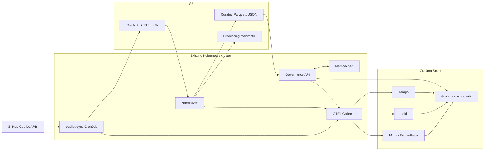

# GitHub Copilot Governance MVP Plan

## Recommended MVP boundary

Build the first version at **GitHub organization scope**, using the existing Kubernetes and Grafana stack. This avoids introducing a new database and avoids enterprise-admin credentials for most functionality.

The MVP should deliver:

- Copilot usage and adoption reporting
- User and repository activity
- Seat utilization
- Optional AI-credit spend
- Team attribution through the existing governance identity model
- Grafana dashboards and alerts
- Raw-data retention and replay in S3
- Operational telemetry through OpenTelemetry

GitHub provides daily aggregated, user-level, and repository-level reports through signed download URLs. GitHub App installation tokens work with the organization-level Copilot metrics endpoints. Seat information is exposed separately through the Copilot user-management API.



# Phase 1 — GitHub connection

## 1. Create the GitHub App

Start with a read-only GitHub App named something such as:

```text
AI Governance – GitHub Copilot
```

Request these organization permissions:

| Permission | Level | Purpose |
|---|---:|---|
| Organization Copilot metrics | Read | Usage, users and repositories |
| GitHub Copilot Business | Read | Seat assignments and activity |
| Metadata | Read | Basic organization information |

The Copilot metrics API accepts GitHub App installation tokens with the `Organization Copilot metrics: read` permission. The seat-assignment endpoint accepts installation tokens with `GitHub Copilot Business: read` or organization administration read access.

Do not request repository content, issues, pull requests or source-code permissions.

## 2. Make billing optional

Organization AI-credit billing can also be fetched with a GitHub App, but GitHub currently requires the relatively broad `Administration: read` organization permission.

Therefore, expose two installation profiles:

```text
Standard
- Usage metrics
- Seats
- Adoption
- Repository activity

Standard + Spend
- Everything above
- Administration: read
- AI-credit billing
```

A stronger security design uses a separate billing GitHub App so the ordinary metrics collector never receives organization administration permission.

For enterprise-level billing, GitHub App tokens are not accepted; an enterprise administrator or billing-manager credential is required. Keep that out of the initial MVP.

# Phase 2 — Kubernetes workload

Use one container image with several commands rather than separate services:

```text
governance-copilot
├── sync-day
├── sync-latest
├── backfill
├── normalize
├── publish-metrics
└── verify
```

## Kubernetes resources

Create a dedicated namespace:

```text
ai-governance-connectors
```

Deploy:

```text
ServiceAccount/copilot-collector
Secret or ExternalSecret/github-copilot-app
ConfigMap/copilot-collector-config
CronJob/copilot-daily-sync
Job/copilot-initial-backfill
Deployment/copilot-query-api
Service/copilot-query-api
NetworkPolicy/copilot-egress
```

The collector does not need an Ingress. Only the governance API should be reachable through the existing Ingress.

## Polling schedule

Because GitHub produces reports daily rather than through a metrics webhook, run the collector every six hours:

```cron
0 */6 * * *
```

On every run, request:

```text
today - 1 day
today - 2 days
today - 3 days
```

This gives automatic recovery when a report is published late. Reprocessing is safe because all objects use deterministic keys.

Configure:

```yaml
concurrencyPolicy: Forbid
successfulJobsHistoryLimit: 3
failedJobsHistoryLimit: 5
backoffLimit: 4
activeDeadlineSeconds: 1800
```

# Phase 3 — Data ingestion

## Reports to ingest

For each organization, ingest:

```text
GET /orgs/{org}/copilot/metrics/reports/organization-1-day
GET /orgs/{org}/copilot/metrics/reports/users-1-day
GET /orgs/{org}/copilot/metrics/reports/repos-1-day
GET /orgs/{org}/copilot/billing/seats
GET /organizations/{org}/settings/billing/ai_credit/usage
```

Use:

```http
Accept: application/vnd.github+json
X-GitHub-Api-Version: 2026-03-10
```

The report APIs return short-lived signed download links, so download each file during the same job and store it immediately in S3. Reports are generated daily, and day-specific historical reports are available for up to one year.

## Initial backfill

On first installation:

1. Fetch the latest 28-day reports.
2. Fetch current seats.
3. Fetch current-month AI-credit usage when billing is enabled.
4. Store and normalize everything.
5. Set the connector status to `READY`.

Afterward, use one-day reports for incremental ingestion.

# Phase 4 — S3 data layout

Use a separate bucket or an isolated prefix:

```text
s3://ai-governance-data/github-copilot/
```

Recommended layout:

```text
github-copilot/
├── raw/
│   └── tenant={tenant_id}/
│       └── org={org}/
│           └── day=2026-07-30/
│               ├── organization.ndjson
│               ├── users.ndjson
│               ├── repositories.ndjson
│               ├── seats.json
│               ├── billing.json
│               └── metadata.json
│
├── curated/
│   └── tenant={tenant_id}/
│       ├── daily-organization/day=2026-07-30/data.parquet
│       ├── daily-users/day=2026-07-30/data.parquet
│       ├── daily-repositories/day=2026-07-30/data.parquet
│       ├── seats/day=2026-07-30/data.parquet
│       └── costs/day=2026-07-30/data.parquet
│
└── manifests/
    └── tenant={tenant_id}/
        └── org={org}/
            └── day=2026-07-30.json
```

Each manifest should record:

```json
{
  "tenant_id": "tenant-123",
  "organization": "customer-org",
  "report_day": "2026-07-30",
  "status": "complete",
  "source_objects": [],
  "record_counts": {},
  "checksums": {},
  "schema_version": 1,
  "started_at": "...",
  "completed_at": "..."
}
```

Use deterministic keys and overwrite-safe processing. This removes the need for a queue or durable processing database in the MVP.

# Phase 5 — Normalized governance model

Normalize all providers into a generic AI-application model instead of exposing Copilot-specific objects everywhere.

## Core records

### Application usage

```text
tenant_id
provider                  github
application               github_copilot
organization_id
report_day
active_users
engaged_users
interaction_count
code_generation_count
code_acceptance_count
loc_suggested
loc_added
loc_deleted
ai_credits
net_cost
currency
```

### User usage

```text
tenant_id
provider_user_id
internal_user_id
organization_id
report_day
last_activity_at
interaction_count
code_generation_count
code_acceptance_count
ai_credits
models[]
features[]
languages[]
ides[]
```

### Seat snapshot

```text
tenant_id
organization_id
provider_user_id
seat_assigned_at
last_activity_at
last_activity_editor
seat_state
snapshot_day
```

### Repository activity

```text
tenant_id
organization_id
repository_id
report_day
coding_agent_activity
code_review_activity
pull_request_activity
```

Keep GitHub usernames out of Prometheus labels. Store them in curated S3 data and expose them only through the governance API.

# Phase 6 — Team attribution

For the organization MVP, join GitHub users to the existing governance identity model:

```text
GitHub login
    ↓
verified email or configured mapping
    ↓
internal user ID
    ↓
department / team / cost center
```

Maintain an explicit mapping table or S3 dataset:

```text
tenant_id
provider
provider_user_id
internal_user_id
team_id
cost_center_id
valid_from
valid_to
mapping_source
```

Do not automatically match users solely by display name.

Later, enterprise customers can use GitHub’s native daily user-to-team report. GitHub documents that team metrics are constructed by joining that report with the per-user usage report; users on multiple teams contribute to each team, and teams with fewer than five seated Copilot users are omitted.

# Phase 7 — Query layer without another database

For the first MVP:

- Keep detailed data in partitioned Parquet on S3.
- Expose aggregate data through Mimir.
- Have the governance API query the relevant S3 partitions.
- Cache common API responses in Memcached for 5–15 minutes.

Suggested endpoints:

```text
GET /api/v1/connectors/github-copilot/status
GET /api/v1/copilot/overview
GET /api/v1/copilot/adoption
GET /api/v1/copilot/seats
GET /api/v1/copilot/users
GET /api/v1/copilot/repositories
GET /api/v1/copilot/costs
GET /api/v1/copilot/pipeline-health
```

Pagination and filters should be server-side:

```text
organization
team
cost_center
date_from
date_to
activity_state
model
feature
language
```

Add PostgreSQL or ClickHouse only when query volume or customer count makes S3 queries unsuitable.

# Phase 8 — OpenTelemetry

Instrument the collector, normalizer and API with OTLP and send everything to the existing Collector gateway.

## Operational metrics

```text
governance_connector_sync_runs_total
governance_connector_sync_errors_total
governance_connector_last_success_timestamp
governance_connector_report_age_seconds
governance_connector_records_processed_total
governance_connector_s3_write_errors_total
governance_connector_github_rate_limit_remaining
governance_connector_download_duration_seconds
governance_connector_normalization_duration_seconds
governance_connector_unmapped_users
```

Labels should remain low-cardinality:

```text
provider
tenant_id
organization_id
report_type
status
```

Avoid labels such as:

```text
username
repository
team
model
session_id
```

## Logs and traces

Structured logs:

```json
{
  "tenant_id": "tenant-123",
  "organization": "customer-org",
  "report_day": "2026-07-30",
  "report_type": "users",
  "records": 428,
  "duration_ms": 1432,
  "status": "success"
}
```

Trace the path:

```text
CronJob
  → GitHub authentication
  → report discovery
  → signed URL download
  → S3 write
  → normalization
  → aggregate publication
```

Never log installation tokens, signed report URLs or report bodies.

# Phase 9 — Grafana dashboards

Provision dashboards through Git rather than creating them manually.

## Dashboard 1: Executive overview

Panels:

- Assigned seats
- Active users
- Seat utilization
- Total AI credits
- Net spend
- Cost per active user
- Adoption trend
- Usage by feature
- Usage by model
- Top-level organization comparison

## Dashboard 2: License hygiene

Panels:

- Assigned but never active
- Inactive for 7, 30 and 60 days
- New seats
- Removed seats
- Reclamation candidates
- Estimated avoidable seat cost

Mark reclamation as a **recommendation**, not an automatic action.

## Dashboard 3: Engineering adoption

Panels:

- Active users by team
- Interaction trend
- Code-generation activity
- Code-acceptance activity
- Languages
- IDEs
- Features
- Repository agent activity

## Dashboard 4: Connector health

Panels:

- Last successful run
- Report age
- Failed downloads
- GitHub API errors
- S3 errors
- Unmapped users
- Normalization duration
- API latency
- GitHub rate-limit status

# Phase 10 — Alerts

Start with five alerts:

```text
No successful sync for 36 hours
Latest report is older than 72 hours
GitHub authentication failed
S3 write or normalization failure
More than 10% of active users cannot be mapped
```

Optional governance alerts:

```text
Seat utilization below configured threshold
Monthly cost exceeds forecast
AI credits increase more than configured percentage
High number of inactive assigned seats
```

Do not alert on every user or repository. Aggregate by tenant and organization.

# Phase 11 — Security

Apply these minimum controls:

- Separate Kubernetes namespace
- Dedicated service account
- Read-only root filesystem
- Non-root container
- No collector Ingress
- Egress restricted to GitHub API and S3
- Secrets provided through External Secrets, CSI or the existing secret system
- S3 encryption and tenant-isolated prefixes
- Signed URL values removed from logs
- Raw user-level data accessible only to governance administrators
- Separate billing credential when billing is enabled
- Configurable raw-data retention
- Audit every user-level governance query

GitHub App installation tokens expire after one hour, so generate them as needed rather than persisting them.

Memcached should only hold:

- Installation tokens
- Short-lived query results
- Identity mappings
- Organization metadata

It must not hold ingestion checkpoints or the sole copy of billing information.

# Implementation sequence

## Sprint 1 — Working ingestion

Deliver:

- GitHub App installation
- Kubernetes CronJob
- Installation-token generation
- Organization and user report download
- S3 raw storage
- Initial 28-day backfill
- OTEL traces, metrics and logs
- Connector status endpoint

Exit condition:

> A customer installs the app and the platform stores a complete, replayable 28-day Copilot dataset in S3.

## Sprint 2 — Governance data

Deliver:

- Normalized S3 datasets
- Seat ingestion
- Identity mapping
- Organization, user and repository APIs
- Aggregate metrics exported to Mimir
- Memcached query caching
- Idempotent reprocessing

Exit condition:

> Rerunning the same day produces no duplicate records and dashboard totals reconcile with the stored source reports.

## Sprint 3 — Product experience

Deliver:

- Four provisioned Grafana dashboards
- Five operational alerts
- Inactive-seat recommendations
- Team and cost-center attribution
- Billing integration behind a feature flag
- Tenant RBAC
- Retention and deletion workflow

Exit condition:

> A customer administrator can connect GitHub, see useful Copilot governance information, identify unused seats and review spend without manual data manipulation.

# Explicitly defer from the MVP

Do not include these initially:

- Raw prompt or generated-code collection
- VS Code extension interception
- Real-time telemetry claims
- Automatic seat removal
- Automatic budget modification
- Enterprise billing credentials
- Enterprise audit-log streaming
- ClickHouse or another analytical cluster
- Cross-provider benchmarking algorithms
- Predictive productivity scoring

## The smallest complete MVP

```text
One GitHub App
One collector image
One six-hourly CronJob
One initial-backfill Job
S3 raw + curated prefixes
One governance query API
Memcached query caching
OTLP into the existing Grafana stack
Four Grafana dashboards
Five alerts
Organization-level usage, users, repositories, seats and optional spend
```

This delivers a credible product without adding Kafka, a webhook receiver, another observability system or a new stateful database.
