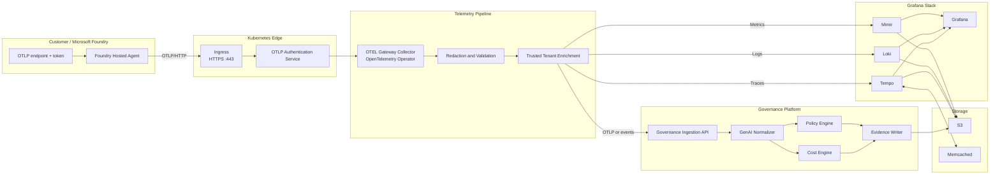
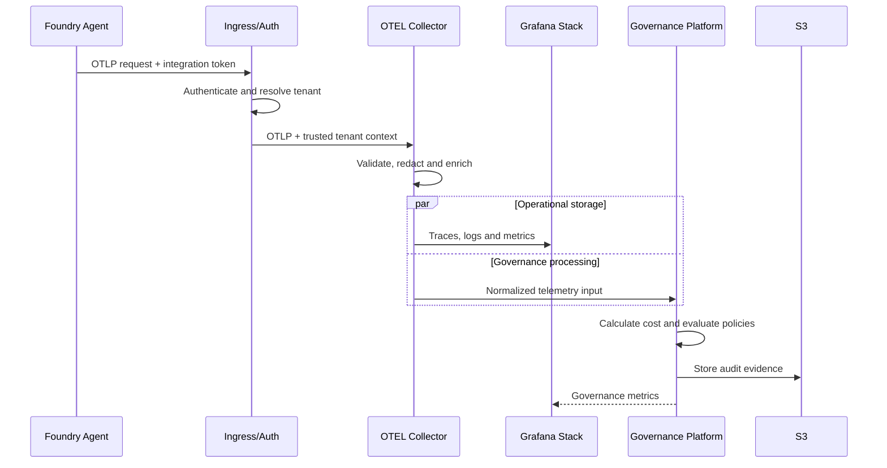

# Microsoft Foundry Governance MVP Plan

## MVP objective

Build the smallest production-shaped version that lets a customer:

1. Register an AI application.
2. Obtain a secure OTLP endpoint and credential.
3. Configure a Microsoft Foundry hosted agent.
4. Send traces, logs, and metrics into your Kubernetes cluster.
5. See operational, cost, quality, and governance insights.
6. Keep each tenant’s data isolated.
7. Detect sensitive content and policy violations.

Foundry hosted agents can export traces, logs, and metrics to any OTLP-compatible endpoint, independently or alongside Application Insights. Changing the export destination requires publishing a new agent version, so your onboarding workflow should account for versioning.

## MVP boundaries

### Include

- Microsoft Foundry hosted agents as the first supported source
- OTLP/HTTP ingestion over HTTPS
- Token-based tenant authentication
- Traces, logs, and metrics
- Tempo, Loki, and Mimir integration
- Normalized GenAI event model
- Token and estimated-cost analytics
- Latency, errors, model calls, and tool calls
- Configurable content redaction
- Five or fewer governance policies
- Grafana dashboards
- A minimal application onboarding page
- Audit evidence in S3

### Exclude initially

- Automatic Azure subscription discovery
- Azure Resource Graph and Cost Management integration
- Complex user-defined policies
- Real-time LLM-based evaluation of every request
- Cross-region ingestion
- Customer-specific collector deployments
- Full prompt-management functionality
- Automated remediation
- Billing and subscription management

Those can follow once the ingestion and tenancy model is stable.

---

## Target MVP architecture



The gateway Collector pattern is appropriate here: external producers send telemetry to one stable OTLP endpoint backed by multiple Collector replicas.

---

## Increment 1 — Establish the product contract

Before adding Kubernetes resources, define what one “AI application” means in your system.

### Core entities

```text
Tenant
  └── Application
       ├── Environment
       ├── Integration
       ├── Agent
       └── Agent Version
```

Recommended identifiers:

```text
tenant_id
application_id
environment
integration_id
agent_id
agent_version
telemetry_source
```

Example trusted resource attributes:

```yaml
governance.tenant.id: tenant-123
governance.application.id: app-456
governance.environment: production
governance.integration.id: integration-789
governance.source: microsoft-foundry
```

Do not accept the authoritative `tenant_id` from the telemetry body. Derive it from the authenticated integration credential.

### Integration record

Your database should minimally hold:

```json
{
  "integration_id": "int_01",
  "tenant_id": "tenant_01",
  "application_id": "app_01",
  "source": "microsoft-foundry",
  "environment": "production",
  "credential_hash": "...",
  "status": "active",
  "content_capture": "metadata_only",
  "created_at": "...",
  "last_telemetry_at": null
}
```

### Deliverable

A customer can create an application and integration and receive:

```text
Endpoint: https://otel.example.com
Protocol: OTLP/HTTP
Authorization: Bearer <integration-token>
```

---

## Increment 2 — Deploy secure OTLP ingestion

Deploy one dedicated external Collector using your existing OpenTelemetry Operator.

### Kubernetes resources

Create:

```text
Namespace: governance-ingestion

OpenTelemetryCollector/foundry-gateway
Service/foundry-gateway
HorizontalPodAutoscaler/foundry-gateway
PodDisruptionBudget/foundry-gateway
NetworkPolicy/foundry-gateway
Ingress or HTTPRoute/otel-public
Secret/collector-backend-credentials
ConfigMap/collector-policies
```

Start with:

- Three Collector replicas
- OTLP/HTTP on port 4318
- HTTPS exposed externally on port 443
- No direct external access to OTLP/gRPC
- Pod anti-affinity across nodes
- Memory limiter and batch processor
- Queueing and retries on exporters
- Strict request-size limits

The Operator supports managing Collector instances as Kubernetes deployments and automatically creates a service based on the configured receivers.

### Authentication design

The Ingress alone should not decide tenancy unless it has a reliable authentication extension.

A practical MVP flow is:

```text
Bearer token
    ↓
Authentication service or gateway
    ↓
Token lookup
    ↓
Trusted integration context
    ↓
Collector
```

The authentication component should resolve:

```json
{
  "tenant_id": "tenant-01",
  "application_id": "app-01",
  "integration_id": "int-01",
  "environment": "production"
}
```

It should then forward only trusted identity headers to the Collector.

Never allow the incoming Foundry agent to set:

```text
X-Scope-OrgID
governance.tenant.id
governance.application.id
```

Tempo assumes that `X-Scope-OrgID` is populated by a trusted authentication proxy.

### Acceptance test

The increment is complete when:

- Unauthorized OTLP requests return `401`.
- Revoked tokens stop working.
- Valid traffic reaches the Collector.
- The authenticated tenant is attached to every signal.
- The endpoint accepts `/v1/traces`, `/v1/logs`, and `/v1/metrics`.
- Collector pods can be restarted without telemetry configuration loss.

---

## Increment 3 — Route to the Grafana stack

Create three signal pipelines.

```yaml
service:
  pipelines:
    traces:
      receivers: [otlp]
      processors:
        - memory_limiter
        - redaction
        - transform
        - batch
      exporters:
        - otlp/tempo
        - otlphttp/governance

    logs:
      receivers: [otlp]
      processors:
        - memory_limiter
        - redaction
        - transform
        - batch
      exporters:
        - otlphttp/loki
        - otlphttp/governance

    metrics:
      receivers: [otlp]
      processors:
        - memory_limiter
        - transform
        - batch
      exporters:
        - otlphttp/mimir
        - otlphttp/governance
```

Use the Grafana backends as operational stores and your governance service as a separate consumer.

### Tempo

Send traces through the OTLP exporter to the Tempo distributor.

The gateway must populate:

```text
X-Scope-OrgID: <trusted-tenant-id>
```

Tempo uses this header to isolate tenant trace data.

### Loki

Use Loki’s native OTLP HTTP endpoint rather than the older Loki-specific exporter. Ensure structured metadata is enabled; it is required for OpenTelemetry log attributes.

Avoid turning every GenAI attribute into a Loki stream label. Keep high-cardinality values such as these in structured metadata:

```text
trace_id
session_id
user_id
model
agent_id
tool_call_id
prompt_name
```

### Mimir

Use Mimir’s native OTLP ingestion endpoint where supported by your installed version.

### Acceptance test

A single Foundry execution must produce:

- One searchable trace in Tempo
- Correlated logs in Loki
- Token, duration, and request metrics in Mimir
- A tenant-isolated query result in Grafana
- A normalized execution record in the governance platform

---

## Increment 4 — Add privacy controls

This is a release blocker, not an optional enhancement. Foundry traces can include prompts, responses, intermediate steps, tool arguments, tool results, token usage, errors, and other execution metadata.

### Support three capture modes

#### Metadata only

Store:

```text
Model name
Token counts
Latency
Status
Tool names
Trace identifiers
Agent identifiers
Evaluation scores
```

Remove:

```text
Prompts
Responses
Tool arguments
Tool results
Retrieved document content
System instructions
```

#### Redacted content

Store content only after:

- Secret detection
- Email and phone masking
- Credential masking
- Configurable regular-expression rules
- Maximum content-length enforcement

#### Full content

Allow only with:

- Explicit tenant opt-in
- Restricted access
- Shorter retention
- Audit logging
- Encryption
- Clear UI warnings

The Collector provides attribute, filter, redaction, and transform processors that can remove or rewrite sensitive attributes before they reach a backend.

### Default policy

Set the MVP default to:

```text
metadata_only
```

Users must explicitly activate content capture.

---

## Increment 5 — Normalize GenAI telemetry

Do not let your product depend directly on every raw OpenTelemetry attribute name. GenAI semantic conventions are still evolving.

Create an internal normalized model.

### Execution record

```json
{
  "execution_id": "trace-id",
  "tenant_id": "tenant-01",
  "application_id": "app-01",
  "source": "microsoft-foundry",
  "environment": "production",
  "agent": {
    "id": "support-agent",
    "version": "v3"
  },
  "started_at": "2026-07-31T15:00:00Z",
  "duration_ms": 1840,
  "status": "success",
  "models": ["gpt-5"],
  "input_tokens": 840,
  "output_tokens": 216,
  "estimated_cost": 0.0124,
  "tool_calls": 2,
  "error_count": 0,
  "content_capture": "metadata_only"
}
```

### Model-call record

```json
{
  "provider": "openai",
  "requested_model": "model-deployment-name",
  "response_model": "actual-model-version",
  "operation": "chat",
  "input_tokens": 840,
  "output_tokens": 216,
  "duration_ms": 720,
  "time_to_first_token_ms": 190,
  "finish_reason": "stop"
}
```

### Tool-call record

```json
{
  "tool_name": "customer_lookup",
  "duration_ms": 310,
  "status": "success",
  "arguments_stored": false,
  "result_stored": false
}
```

Keep the original raw span reference:

```text
trace_id
span_id
raw_backend
raw_schema_version
```

This lets users jump from your governance view to the corresponding Tempo trace.

---

## Increment 6 — Implement four governance capabilities

A full MVP does not need a large rule engine. It needs a few useful decisions that users cannot easily get from ordinary observability.

### 1. Cost

Calculate estimated cost from:

```text
Provider
Requested model
Resolved model version
Input tokens
Output tokens
Cached tokens, when present
Pricing effective date
```

Maintain a versioned pricing table:

```json
{
  "provider": "openai",
  "model_pattern": "...",
  "input_price_per_million": 0,
  "output_price_per_million": 0,
  "effective_from": "...",
  "effective_until": null
}
```

Label the output as **estimated cost** until it is reconciled against Azure billing.

Show:

- Cost per application
- Cost per execution
- Cost per model
- Cost per tenant
- Cost per successful execution
- Daily token volume

### 2. Reliability

Calculate:

- Successful execution rate
- Model error rate
- Tool error rate
- P50 and P95 latency
- P95 model latency
- P95 tool latency
- Retry count
- Timeout count

### 3. Privacy

Start with three policies:

```text
Full content captured in production
Secret-like content detected
Unapproved sensitive attribute present
```

### 4. Model governance

Start with:

```text
Unapproved model used
Unknown model used
Application missing owner metadata
Application exceeds daily token budget
```

Each violation should produce:

```json
{
  "policy_id": "unapproved-model",
  "severity": "high",
  "application_id": "app-01",
  "execution_id": "trace-id",
  "detected_at": "...",
  "evidence": {
    "model": "some-model"
  },
  "status": "open"
}
```

Write durable evidence to S3, but keep searchable violation metadata in your application database.

---

## Increment 7 — Build the minimum user experience

The MVP needs only five main views.

### Applications

Show:

- Application name
- Owner
- Environment
- Source
- Last telemetry received
- Status
- Open violations
- Current daily cost

### Application overview

Show:

- Total executions
- Success rate
- P95 latency
- Total tokens
- Estimated cost
- Open policy violations
- Most-used models
- Most-used tools

### Executions

A searchable list containing:

- Timestamp
- Duration
- Status
- Model
- Tokens
- Estimated cost
- Tool-call count
- Policy result
- Link to Tempo

### Policies

Show:

- Policy
- Severity
- Affected application
- Execution
- Evidence
- First and last occurrence
- Acknowledge/resolved status

### Integration setup

Generate copyable Foundry configuration:

```yaml
environment_variables:
  - name: OTEL_EXPORTER_OTLP_ENDPOINT
    value: https://otel.example.com

  - name: OTEL_EXPORTER_OTLP_PROTOCOL
    value: http/protobuf

  - name: OTEL_EXPORTER_OTLP_HEADERS
    value: Authorization=Bearer <integration-token>
```

Also show:

```text
Connection status: Receiving telemetry
Last received: 31 July 2026, 17:42 CEST
Signals: Traces ✓ Logs ✓ Metrics ✓
```

Warn users that changing these environment variables requires publishing a new Foundry hosted-agent version.

---

## Increment 8 — Add the first Grafana dashboards

Create three dashboards.

### AI application overview

Panels:

```text
Executions per minute
Success rate
P50/P95 latency
Input and output tokens
Estimated cost
Model usage
Tool success rate
Open governance violations
```

### Agent execution drill-down

Include:

```text
Tempo trace visualization
Model spans
Tool-call spans
Correlated Loki logs
Token metrics
Execution policy results
```

### Platform ingestion health

Monitor your own product:

```text
OTLP requests
Authentication failures
Rejected spans
Dropped attributes
Collector queue size
Exporter failures
Backend latency
Governance ingestion lag
S3 write failures
Tenant traffic volume
```

Your platform-health dashboard is essential. Otherwise, “no violations” could simply mean “no telemetry.”

---

## Increment 9 — Validate with one Foundry reference application

Build a deterministic test agent with:

- One model call
- One successful tool call
- One failing tool call
- One retrieval-style operation
- One intentionally sensitive prompt
- One unapproved-model test
- One high-token request
- One timeout scenario

Create a golden telemetry dataset containing expected:

```text
Spans
Logs
Metrics
Normalized executions
Costs
Policy violations
Redactions
```

Run this dataset in CI whenever you change:

- Collector configuration
- Normalization rules
- Backend versions
- Pricing rules
- Policy logic

### End-to-end test



---

## Increment 10 — Production hardening

Before calling it an MVP release, implement these controls.

### Availability

- At least three gateway replicas
- PodDisruptionBudget
- Anti-affinity
- Horizontal autoscaling
- Retry queues
- Graceful shutdown
- Backend timeout configuration

### Abuse prevention

- Per-token rate limiting
- Maximum body size
- Maximum spans per request
- Maximum attribute length
- Maximum event count
- Maximum prompt/content length
- Token revocation
- Traffic quotas per tenant

Use backend-specific ingestion and tenant runtime limits as a second line of defense behind your public gateway.

### Isolation

Verify that tenant A cannot:

- Write as tenant B
- Query tenant B
- Use tenant B’s Grafana data source
- Guess another tenant’s S3 evidence path
- Access another tenant through trace links

### Retention

A reasonable MVP policy:

| Data | Initial retention |
|---|---:|
| Metrics | 30–90 days |
| Traces | 14–30 days |
| Logs | 14–30 days |
| Full prompt content | 7 days maximum |
| Governance findings | 90–365 days |
| Audit evidence | Configurable |

The exact numbers should be tenant-configurable later.

---

## Recommended implementation order

```text
1. Application and integration registry
2. Credential issuance and revocation
3. Public authenticated OTLP endpoint
4. Tenant enrichment
5. Tempo trace ingestion
6. Loki log ingestion
7. Mimir metric ingestion
8. Governance ingestion
9. GenAI normalization
10. Metadata-only privacy mode
11. Cost calculation
12. Five core policies
13. Application overview UI
14. Execution drill-down
15. Foundry onboarding wizard
16. End-to-end and isolation tests
17. Load testing and release
```

Do not begin with dashboards or evaluation models. First establish reliable, tenant-isolated ingestion.

---

## MVP definition of done

The MVP is ready when a new customer can complete this scenario without engineering assistance:

1. Create an application.
2. Create a Microsoft Foundry integration.
3. Copy the generated endpoint and token.
4. Publish a Foundry hosted-agent version using those settings.
5. Execute the agent.
6. See the execution appear within a short ingestion window.
7. Open its Tempo trace.
8. See token usage and estimated cost.
9. See model calls and tool calls.
10. Trigger and inspect a governance violation.
11. Verify that sensitive content was removed according to policy.
12. Revoke the integration token and confirm ingestion stops.
13. Confirm that another tenant cannot access the data.

That gives you a genuine end-to-end governance MVP, rather than only a Foundry-to-Grafana telemetry demonstration.
