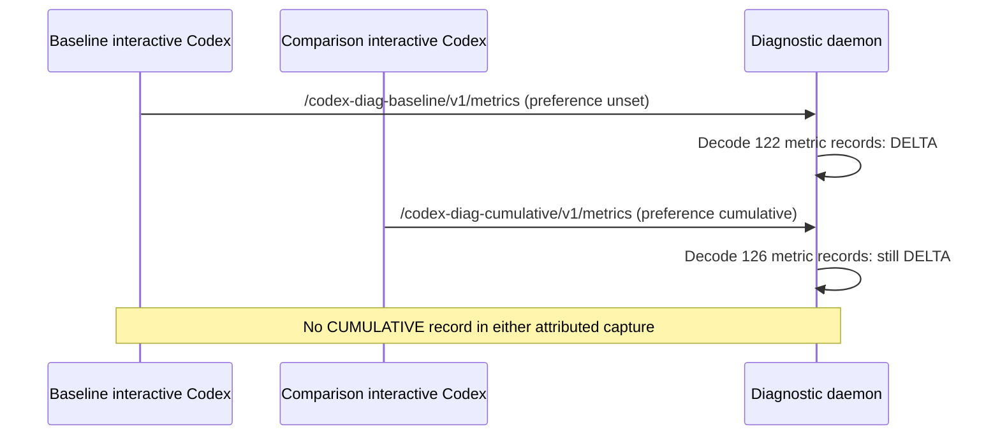
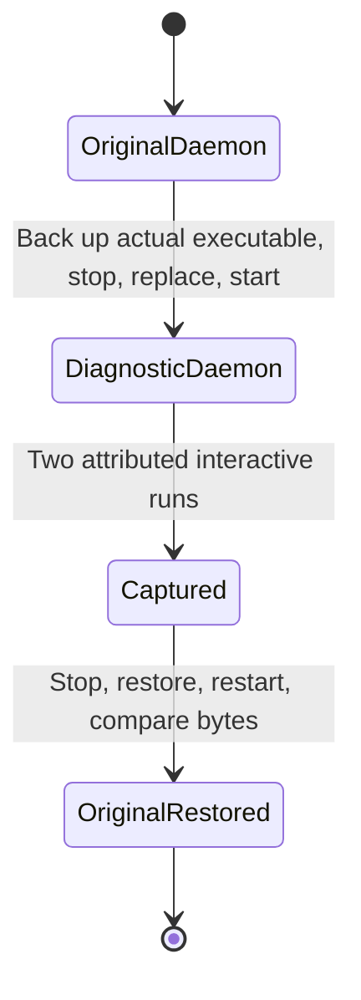

# Verify (or refute) Codex's OTLP metrics temporality, live

**Status: executed on 2026-09-15 with Codex CLI 0.154.0. Both the baseline
and the cumulative-environment comparison emitted DELTA on the wire.** The
standard environment variable did not change temporality in this build.
See [Observed result](#observed-result-2026-09-15) for the captured evidence
and limits. The procedure below remains available for retesting later builds;
its conditional outcomes are instructions, not additional observed results.

## Observed result (2026-09-15)

**Confirmed: DELTA in both runs; the environment-only workaround does not
work in Codex CLI 0.154.0.** This establishes the wire behavior, not whether
Codex overrides the preference or its SDK ignores it. Downstream conversion
and the eventual appearance of named Mimir series remain unverified fixes.

| Run | Temporality process environment | Metric records | Distinct names | Sum of data-point counts | Wire temporality |
|---|---|---:|---:|---:|---|
| Baseline | Explicitly unset | 122 | 72 | 508 | DELTA (`Some(1)`) for all records |
| Comparison | `cumulative` | 126 | 72 | 512 | DELTA (`Some(1)`) for all records |

Counts include periodic exports and the shutdown flush; they are not counts
of unique series. All emitted Sum records reported `is_monotonic=true`;
Histogram records omit that field. No Gauge or UNSPECIFIED/CUMULATIVE record
was observed in these two captures. The diagnostic's Histogram arm does not
cover ExponentialHistogram; none appeared as an unhandled record here.

**Evidence:** [all 248 metric metadata records](evidence/codex-metrics-temporality-2026-09-15.log).
The baseline capture spans **10:24:29.721112–10:27:05.908989 UTC**;
the comparison spans **10:24:49.891222–10:27:05.912469 UTC**. Both TUIs
remained open for more than three minutes, with two rounds of real shell
activity: reading the runbook, `git status --short`, and `date -u`.
The TUI confirmed `runtime_metrics` enabled. Process-environment inspection
confirmed the baseline unset (PID 145420) and comparison `cumulative`
(PID 147094). These are the installed interactive CLI, not `codex exec`.





The receive/classify/instrumentation boundary is
[`app/governance-auth/src/otel_daemon/mod.rs:176`](../../app/governance-auth/src/otel_daemon/mod.rs#L176),
before `retained_response` at line 184 in source commit
`f2604ce`. The temporary diagnostic in Step 2 added only the incoming path
and the listed metric metadata; no values, tokens, log/trace bodies, or
arbitrary resource attributes were recorded. The lifecycle above was
executed with an EXIT/INT/TERM restoration trap and a 15-minute timeout.

### Official Codex documentation checked (2026-09-15)

The [Configuration Reference](https://learn.chatgpt.com/docs/config-file/config-reference)
lists `otel.metrics_exporter` choices (`none`, `statsig`, `otlp-http`,
`otlp-grpc`), but no temporality key. The
[advanced configuration guide](https://learn.chatgpt.com/docs/config-file/config-advanced#otel-metrics-emitted)
documents the OTel counters and histograms. Neither page documents
`OTEL_EXPORTER_OTLP_METRICS_TEMPORALITY_PREFERENCE` or promises cumulative
export. Documentation silence alone is not evidence of runtime behavior;
the captures above establish the behavior of 0.154.0.

The guide explicitly scopes
[`shell_environment_policy`](https://learn.chatgpt.com/docs/config-file/config-advanced#shell-environment-policy)
to spawned commands. It is not a documented configuration mechanism for
Codex's own OTel initialization. A wrapper that merely sets the tested
variable has no demonstrated benefit: the comparison already supplied it
to the actual Codex process.

**Decision for this build:** stop pursuing the environment-only workaround.
Evaluate downstream delta-to-cumulative conversion, or an upstream Codex
change that exposes a working selector. Do not generalize the measured
result to every future build, or claim the docs prove an SDK bug.

### Live pipeline configuration checked

- Deployment `governance/lightbridge-governance-ai-cli-otel-collector`
  mounted ConfigMap `lightbridge-governance-ai-cli-otel-collector-2f4b2e77`.
  Its `collector.yaml` lines 138–148 route metrics through
  `memory_limiter`, `resource`, `transform/client_address_from_xff`, and
  `batch`, then export to `otlp/alloy` and `awss3`. No delta converter.
- ConfigMap `observability/alloy`, `config.alloy` lines 321–330, routes
  OTLP metrics directly to `otelcol.exporter.prometheus.default.input`.
  Lines 553–555 forward Prometheus samples to the existing relabel/remote
  write chain. No delta converter.

These live checks corroborate the pipeline configuration described below.
They do not prove end-to-end recovery: no cluster change, converter test,
or new Mimir-series verification was performed. The next fix to evaluate
is `deltatocumulative` before Prometheus conversion, with appropriate
handling of state and routing across collector replicas.

### Runbook corrections and cleanup

- The current host environment already contained `cumulative`. Explicitly
  unsetting it was necessary for an uncontaminated baseline.
- Existing sessions also emit metrics. The first untagged exploratory run
  observed `codex-app-server` DELTA records, but is excluded from the table.
  Both final runs used distinct loopback paths (command-line overrides
  only). Their resource `service.name` was `Codex Desktop`, so future
  searches must not assume only the two historical job names below.
- The service executable was the repository's `target/debug/governance-auth`,
  not `~/.local/bin/governance-auth`. Steps 3 and 6 now use the actual
  running executable. The CLI on PATH reported v2.7.0, but that alone
  would not identify the service binary.
- The original executable was restored byte-for-byte, and the service
  reported `active`. Original and restored SHA-256:
  `672b59d0541ae5b837ea59c9b7d3dbca493bbef7fdecb04b4f018a572cb097a2`.
  Temporary instrumentation was confined to the disposable worktree, which
  was removed after capture. No diagnostic records appeared after restoration.
  Persistent Codex configuration and cluster configuration were not changed.

## Why this exists

Claude Code's `claude_code.lines_of_code.count`/`.active_time.total`/etc.
metrics never appeared in Mimir until
[lightbridge-governance#335](https://github.com/ADORSYS-GIS/lightbridge-governance/pull/335)
set `OTEL_EXPORTER_OTLP_METRICS_TEMPORALITY_PREFERENCE=cumulative`. Root
cause: Claude Code's documented default is `delta`, and this org's collector
pipeline (`ai-cli-otel` collector, Alloy) has no `deltatocumulative`
processor anywhere -- Prometheus/Mimir's data model has no delta concept, so
a well-formed delta export simply never becomes a queryable series. See
`docs/integrations/claude-code-dashboard.md`'s "Lines of code, active time,
commits" section for the full account, including how it was confirmed
(a temporary, reverted daemon instrumentation that decoded the actual OTLP
protobuf bytes).

**Codex shows the identical symptom, checked live on 2026-09-15:**

- Mimir, both Codex job labels, full 7-day window: `job="codex-app-server"`
  (23 distinct resources) and `job="codex_cli_rs"` (3 resources) carry
  **only** `target_info` -- zero named `codex_*`/`codex.*` metric series,
  ever, in that window.
- Codex's own local telemetry log on this machine
  (`~/.codex/logs_2.sqlite`, table `logs`) has a real historical entry from
  2026-09-11 (`app.version=0.135.0`, an interactive `codex-tui` session):
  `PeriodicReaderMetricsCollected count=12` immediately followed by
  `HttpMetricsClient.ExportStarted` then `HttpMetricsClient.ExportSucceeded`
  -- Codex's own Rust OTel SDK (`telemetry.sdk.language=rust`,
  `telemetry.sdk.version=0.31.0`, confirmed via the matching Loki log lines
  for that session) believed it successfully POSTed 12 metric points to the
  daemon. That timestamp falls inside the 7-day Mimir window above.
- **Now confirmed by the run below:** Codex CLI 0.154.0 emitted
  `aggregation_temporality=1` (DELTA), including when
  `OTEL_EXPORTER_OTLP_METRICS_TEMPORALITY_PREFERENCE=cumulative` was set.
  The exact 2026-09-11 payload was not retained by this diagnostic; the
  historical symptom is consistent with the newly captured behavior.
- **Methodology limitation:** earlier `codex exec` experiments reportedly
  produced no new `logs_2.sqlite` rows, including with `runtime_metrics`
  enabled. Absence from that local log is not proof that every non-interactive
  build can never export metrics. This verification used actual interactive
  TUIs and captured their OTLP exports directly; use that proven method to
  reproduce these results.
- The installed 0.154.0 build listed `runtime_metrics` as under development
  and disabled by default. Both recorded runs enabled it to maximize the
  metric surface. Whether every baseline instrument requires that flag was
  not tested.

## Step 1 -- isolate the work

Everything below is a **temporary, reverted** change to a debug build of the
daemon. Do it in a separate git worktree so it never touches your actual
working branch:

```sh
cd /path/to/lightbridge-governance
git worktree add --detach /tmp/codex-metrics-diag HEAD
cd /tmp/codex-metrics-diag
```

## Step 2 -- add the temporary diagnostic

Open `app/governance-auth/src/otel_daemon/mod.rs`. Find `handle_request`,
specifically the line right after signal classification:

```rust
    let Some(signal) = classify::signal(&incoming.body, incoming.format, &incoming.path) else {
        return StatusCode::BAD_REQUEST.into_response();
    };
    let body = if signal == signal::Signal::Logs {
```

Insert this block between those two lines (before `let body = ...`):

```rust
    // TEMPORARY DIAGNOSTIC -- not for commit. Decodes only metric names,
    // data-point counts, and the wire-level aggregation_temporality/
    // is_monotonic fields -- never values or log/trace bodies.
    if signal == signal::Signal::Metrics && incoming.format == receive::WireFormat::Protobuf {
        use opentelemetry_proto::tonic::collector::metrics::v1::ExportMetricsServiceRequest;
        use opentelemetry_proto::tonic::metrics::v1::metric::Data;
        use prost::Message;
        match ExportMetricsServiceRequest::decode(incoming.body.as_slice()) {
            Ok(req) => {
                for rm in &req.resource_metrics {
                    let service_name = rm
                        .resource
                        .as_ref()
                        .and_then(|r| r.attributes.iter().find(|kv| kv.key == "service.name"))
                        .and_then(|kv| kv.value.as_ref())
                        .and_then(|v| v.value.clone())
                        .map(|v| format!("{v:?}"))
                        .unwrap_or_default();
                    for sm in &rm.scope_metrics {
                        for m in &sm.metrics {
                            let (data_points, temporality, is_monotonic) = match &m.data {
                                Some(Data::Sum(d)) => (d.data_points.len(), Some(d.aggregation_temporality), Some(d.is_monotonic)),
                                Some(Data::Gauge(d)) => (d.data_points.len(), None, None),
                                Some(Data::Histogram(d)) => (d.data_points.len(), Some(d.aggregation_temporality), None),
                                _ => (0, None, None),
                            };
                            tracing::info!(path = %incoming.path, service_name, name = %m.name, data_points, ?temporality, is_monotonic, "DIAG metric");
                        }
                    }
                }
            }
            Err(error) => tracing::info!(%error, "DIAG failed to decode ExportMetricsServiceRequest"),
        }
    }
```

`temporality` prints as `Some(1)` for DELTA, `Some(2)` for CUMULATIVE,
`Some(0)` for UNSPECIFIED, `None` for a Gauge (gauges have no temporality
concept). This is the exact instrumentation used to confirm Claude Code's
root cause; nothing here is Codex-specific except that it's generic across
any client hitting the daemon's `/v1/metrics`.

## Step 3 -- build and swap the binary

```sh
cargo build -p governance-auth --bin governance-auth

# Resolve the executable actually running: ExecStart may point at a repository
# target/debug binary rather than ~/.local/bin/governance-auth.
# Keep these variables in this shell through Step 6.
daemon_pid=$(systemctl --user show governance-auth-serve-otel.service -p MainPID --value)
daemon_binary=$(readlink -f "/proc/$daemon_pid/exe")
test -x "$daemon_binary" || exit 1
backup="${daemon_binary}.temporality-backup"
test ! -e "$backup" || exit 1
cp -p "$daemon_binary" "$backup"

# Stop FIRST: overwriting a running executable fails with "Text file busy".
systemctl --user stop governance-auth-serve-otel.service
cp target/debug/governance-auth "$daemon_binary"
systemctl --user start governance-auth-serve-otel.service
systemctl --user status governance-auth-serve-otel.service --no-pager | head -6
```

Confirm it's the debug build actually running (`Main PID` should be a fresh
process, started just now).

## Step 4 -- tail the log while running a REAL interactive session

```sh
tail -f ~/.local/state/governance-auth/logs/governance-auth.log | grep --line-buffered "DIAG"
```

In a **separate terminal**, run Codex interactively (not `codex exec` --
see the methodology trap above) for at least 2-3 minutes of real activity
-- ordinary usage is fine, the point is just enough wall-clock time for the
periodic metrics reader to tick at least once (Codex's own log showed a
~40-60s interval). Two runs are worth doing:

1. **Baseline**, explicitly unset the temporality preference; the host may
   already inherit `cumulative`. Enable `runtime_metrics` for maximum coverage.
   A distinct loopback path attributes the diagnostic to this run:
   ```sh
   env -u OTEL_EXPORTER_OTLP_METRICS_TEMPORALITY_PREFERENCE \
     codex --enable runtime_metrics \
     -c 'otel.metrics_exporter.otlp-http.endpoint="http://127.0.0.1:17457/codex-diag-baseline/v1/metrics"'
   ```
   (or `codex features enable runtime_metrics` once, if you'd rather not
   pass the flag every time -- remember to `codex features disable
   runtime_metrics` afterward if you do, since it's `under development`).

2. **With the standard OTel env var set**, to test whether Codex's Rust SDK
   honors it despite its absence from the checked Codex documentation:
   ```sh
   OTEL_EXPORTER_OTLP_METRICS_TEMPORALITY_PREFERENCE=cumulative \
     codex --enable runtime_metrics \
     -c 'otel.metrics_exporter.otlp-http.endpoint="http://127.0.0.1:17457/codex-diag-cumulative/v1/metrics"'
   ```

Do some real work in each session (ask it to read a file, make an edit,
run a command -- anything that exercises `tool.call`/`api_request`-shaped
activity) so there's something for the metric instruments to actually
record, then let the session sit for the remainder of the 2-3 minutes
before exiting.

## Step 5 -- read the result

Filter by the run-specific `path` so another desktop session cannot contaminate
its result. For each of the two runs, record every `DIAG metric` line: `name`,
`data_points`, `temporality`, `is_monotonic`. Then:

- **If `temporality` is ever `Some(1)` (DELTA) in the baseline run**: root
  cause confirmed, matching Claude Code exactly.
  - **If the env-var run shows `Some(2)` (CUMULATIVE) instead**: the fix is
    exactly as small as Claude Code's -- get this environment variable into
    Codex's process environment. Check whether `~/.codex/config.toml`
    supports an env-var-injection mechanism for its own child process
    (`shell_environment_policy` governs the *shell tool's* environment, not
    necessarily Codex's own -- verify which one, if either, actually
    affects Codex's own OTel SDK init before assuming either one works).
    If neither does, this may need to go into `governance-auth
    configure_codex`'s own process-launch wrapper, or Codex may need to be
    launched via a shell function/wrapper script that exports it -- check
    against this repo's own rule in `app/governance-auth/src/otel/client_scope_tests.rs`
    (`shell_exports_carry_no_otel_key`) before reaching for the shared
    shell rc files: a client-specific OTLP setting was deliberately kept out
    of the machine-global shell after a real incident (one client's OTLP
    endpoint leaking into another's), and a temporality preference is the
    same category of per-client setting.
  - **If the env-var run ALSO shows `Some(1)` (DELTA)**: Codex's Rust SDK
    does not honor the standard env var (or something else overrides it).
    The fix has to live downstream instead: add a `deltatocumulative`
    processor to the `ai-cli-otel` collector's or Alloy's metrics pipeline
    (see `docs/integrations/claude-code-dashboard.md`'s note on this being
    the more centralized, higher-blast-radius alternative -- it protects
    every future client, not just Codex, but touches shared cluster config
    in `ai-helm-values`, not just this repo).
- **If `temporality` is consistently `Some(2)` (CUMULATIVE) already**: the
  delta/cumulative hypothesis is wrong for Codex. In that case, re-open the
  investigation from the symptom itself (target_info-only, zero named
  series) -- check the collector/Alloy self-metrics the same way the Claude
  Code investigation did (`otelcol_receiver_accepted_metric_points_total`
  vs `otelcol_exporter_sent_metric_points_total` on the `ai-cli-otel`
  collector; `otelcol_receiver_accepted_metric_points_total` and
  `prometheus_forwarded_samples_total{component_id="otelcol.exporter.prometheus.default"}`
  on each Alloy pod) to find where else in the pipeline it could be
  disappearing.
- **If zero `DIAG metric` lines appear at all**, even after 2-3 minutes of
  real activity: something more basic is blocking Codex's metrics export
  from ever reaching the daemon (a connectivity issue, an auth failure
  specific to the metrics endpoint, or the interactive/app-server path
  behaving differently on this machine than the 2026-09-11 session did).
  Check `journalctl --user -u governance-auth-serve-otel.service` for any
  `WARN`/`ERROR` in the same window, and confirm
  `~/.codex/config.toml`'s `[otel.metrics_exporter.otlp-http]` block is
  actually present and points at the daemon.

## Step 6 -- revert, every time, even if you didn't finish

```sh
systemctl --user stop governance-auth-serve-otel.service
cp -p "$backup" "$daemon_binary"
systemctl --user start governance-auth-serve-otel.service
cmp "$backup" "$daemon_binary"  # must match byte-for-byte
rm "$backup"

cd /path/to/lightbridge-governance
git worktree remove /tmp/codex-metrics-diag --force
```

Confirm the restored daemon is the real one: the byte comparison above must
succeed, `systemctl --user is-active governance-auth-serve-otel.service` must
report `active`, and
`journalctl --user -u governance-auth-serve-otel.service -n 5` should show
a normal restart with no diagnostic output.

## After this runbook

Done for Codex CLI 0.154.0: root cause confirmed (DELTA on the wire,
in both the baseline and the standard-env-var comparison), and the
environment-only fix ruled out for this build -- see "Observed result"
above. Not yet done, and the actual next step:

- Evaluate adding a `deltatocumulative` processor to the metrics pipeline
  (the `ai-cli-otel` collector or Alloy -- see "Live pipeline configuration
  checked" above for exactly which config files and line ranges have no
  such processor today). This is a cluster-wide, `ai-helm`/`ai-helm-values`
  change, not something this repo alone can land -- it protects every
  future client hitting this pipeline, not just Codex.
- After that processor exists, re-run Steps 3-5 of this runbook (or check
  Mimir directly for a named `codex_*`/`codex.*` series) to confirm the
  fix actually produces a queryable series end-to-end, the same way
  `claude_code_lines_of_code_count_total` etc. were confirmed live after
  #335.
- If a Codex-specific dashboard/measurement doc gets written (mirroring
  `docs/integrations/claude-code-dashboard.md`), fold this runbook's
  confirmed result into it rather than leaving this as the only record.
- Retest against later Codex CLI builds if the upstream project changes
  its OTel SDK configuration or exposes a working temporality selector --
  this result is dated and version-scoped, not a permanent property of
  Codex.
