# Origin CLI

> **Sources:** [getorigin.io](https://getorigin.io/) · [Documentation](https://getorigin.io/docs) ·
> [CLI command reference](https://getorigin.io/docs/cli/commands) ·
> [GitHub: opsworks-co/origin-cli](https://github.com/opsworks-co/origin-cli)

## Overview

[Origin](https://getorigin.io/) is an AI coding activity and provenance tool that makes work
performed by AI coding agents visible, traceable, and attributable to a Git repository.

Its core idea is **AI coding provenance**: connecting the development chain:

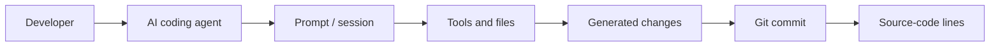

Origin is designed to work with AI coding environments such as Claude Code, Codex CLI, Cursor,
Gemini CLI, GitHub Copilot, Aider, Windsurf, Antigravity, and other supported agents.

## Main Features

### AI Session Tracking

Origin can capture:

- AI agent and model
- sessions and prompts
- prompt sequence
- tools used
- files read and modified
- token usage
- estimated cost
- session state
- generated diffs

### Prompt Tracking

Origin captures prompts submitted to supported agents and associates prompts with activity
occurring during the corresponding AI session.

This makes it possible to investigate both:

> What did the developer ask the AI to do?

and:

> What code resulted from that request?

### Agent Hooks and Transcript Parsing

Origin uses a combination of **native agent hooks and transcript parsing**.

Different AI agents expose different mechanisms, so Origin has agent-specific integrations that
normalize activity into a common representation.

Conceptually:

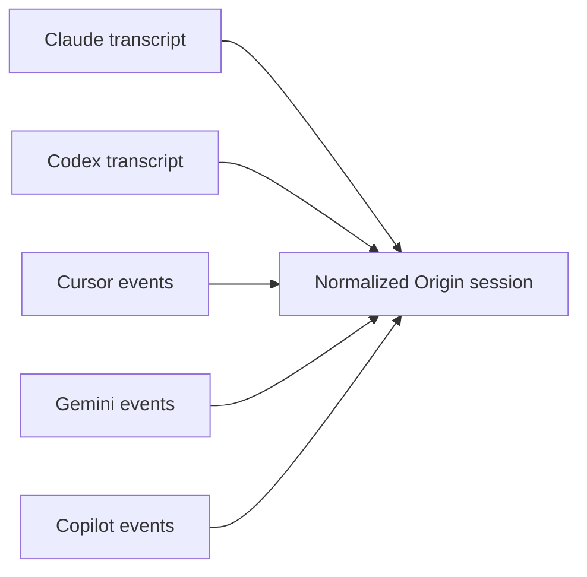

Supported lifecycle events can include:

- session start
- prompt submission
- tool execution
- file edits
- agent completion
- session end

Origin also watches agent transcript files so that session information can be recovered when
lifecycle hooks are insufficient.

## Git Integration

Git is fundamental to Origin.

Origin combines information reported by the AI agent with the actual state of the Git working
tree and commit history.

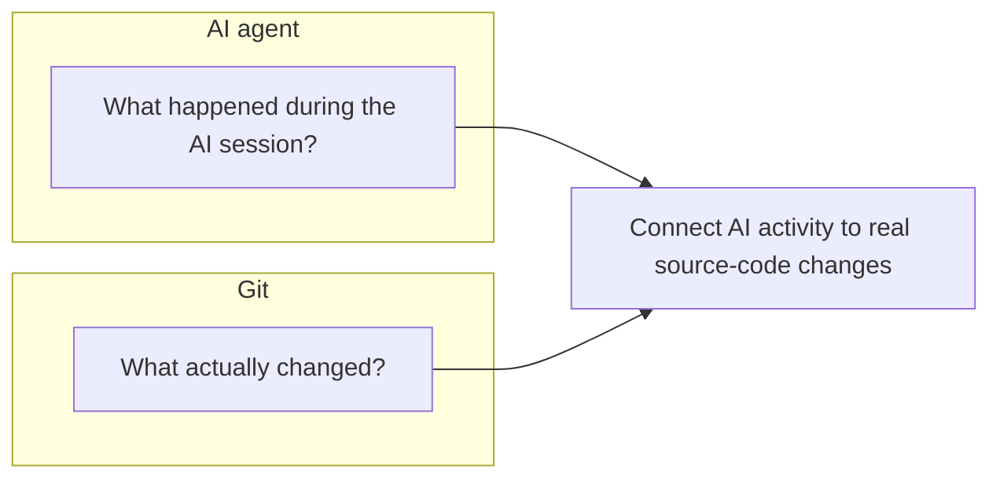

This makes it possible to connect AI activity to real source-code changes.

## Git Notes and Origin Metadata

Origin uses Git metadata facilities to associate AI provenance with repository history.

The primary ref is:

```text
refs/notes/origin
```

which stores per-commit model / session / cost / token metadata. Origin also maintains
session-related data on the `origin-sessions` **branch**, which carries transcripts, prompts,
and file changes.

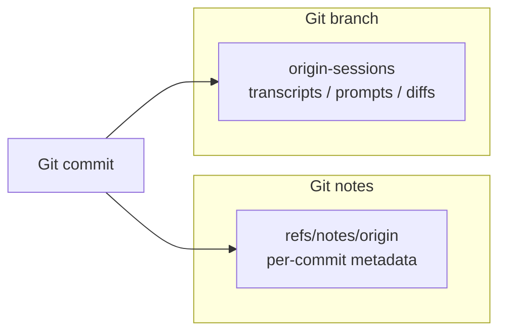

The metadata can connect a Git commit to an Origin session and its associated AI activity.

This is a major part of Origin's local-first design: AI provenance can live alongside the
repository's Git history.

## Prompt-to-Commit Attribution

Origin attempts to associate AI prompts and sessions with the changes produced by that activity.

A simplified flow is:

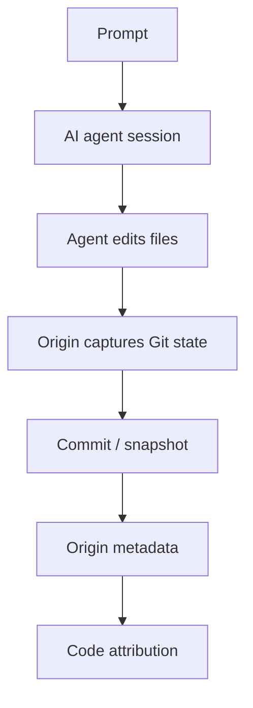

Origin maintains per-prompt/shadow Git state to distinguish changes made during different
prompts, including changes that occur before a final commit.

## Line-Level Attribution

One of Origin's most notable features is AI-aware Git blame.

Traditional Git can identify the commit responsible for a line:

```bash
git blame src/auth.ts
```

Origin extends this concept:

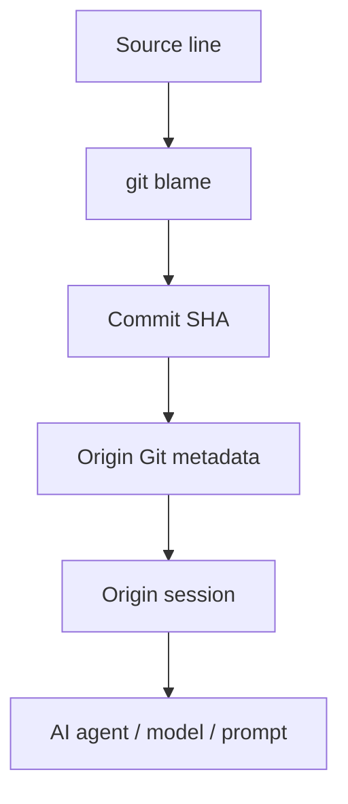

This enables commands such as:

```bash
origin blame
origin why
```

to provide AI provenance for source-code changes. See the
[`origin why` announcement](https://getorigin.io/blog/origin-why-line-level-prompt-attribution).

The goal is to answer:

- Which AI agent produced this line?
- Which session produced it?
- Which prompt caused the change?
- Which model was involved?
- Which commit introduced it?

## Tool and File Tracking

Origin recognizes common AI-agent operations for reading and modifying files.

Examples include tools corresponding to:

```text
Read
Write
Edit
NotebookEdit
read_file
write_file
replace
apply_diff
search_replace
```

This allows Origin to build records such as:

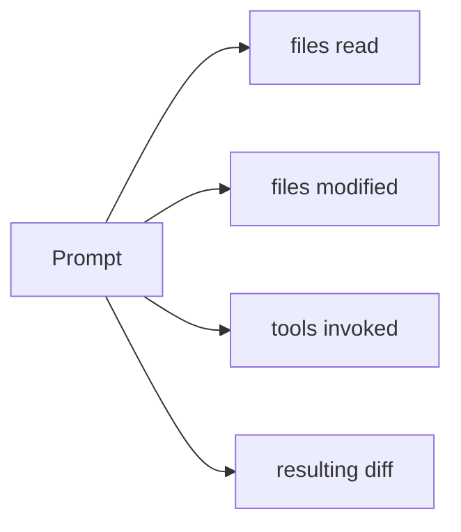

## Token and Cost Tracking

Origin can track model usage information including:

- input tokens
- output tokens
- cached tokens
- total tokens
- estimated cost

This supports AI cost attribution and usage analysis.

## Local / Solo Architecture

Origin's local mode is designed to work without requiring a centralized Origin server.

Conceptually:

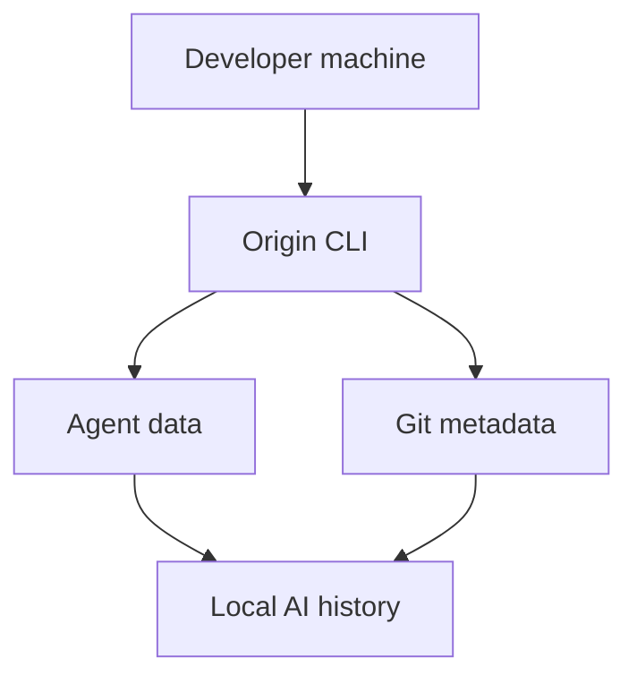

Origin's public CLI repository documents Git notes and Git refs as part of its local storage
architecture.

This means AI development history can remain local and can be synchronized with the repository
when the relevant Git refs are shared.

## Team / Connected Architecture

Origin also provides a centralized team-oriented product.

The team model adds capabilities such as:

- centralized AI activity visibility
- team dashboards
- user-level AI usage
- cost attribution
- policies
- budgets
- audit information
- governance
- PR checks and automation

Conceptually:

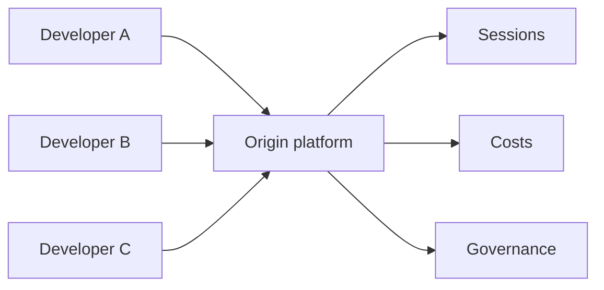

Thus:

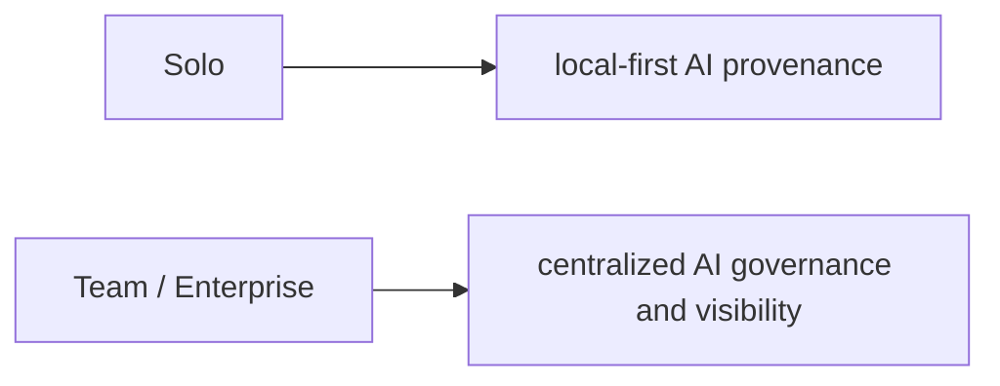

## Origin vs LLM Gateway Telemetry

Origin should not be confused with conventional LLM API observability.

An LLM gateway such as Envoy AI Gateway can observe:

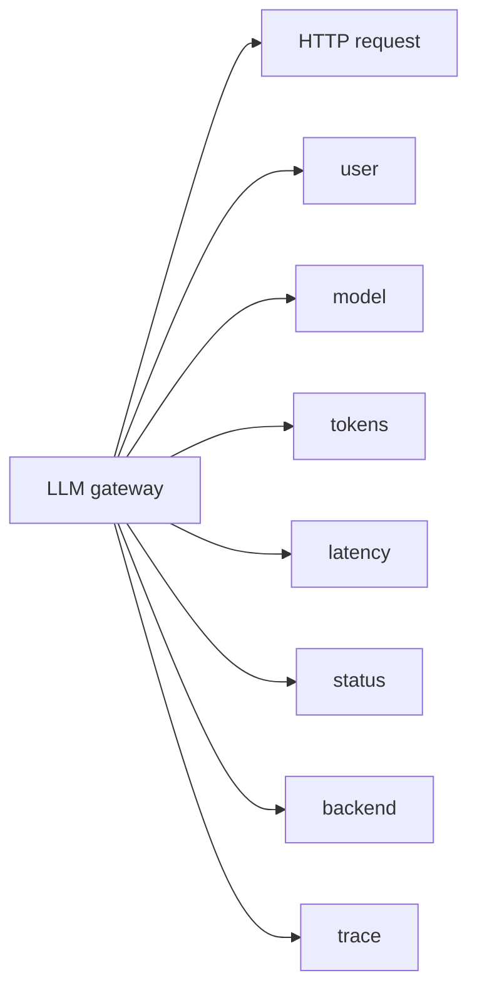

Origin operates closer to the developer and AI-agent layer:

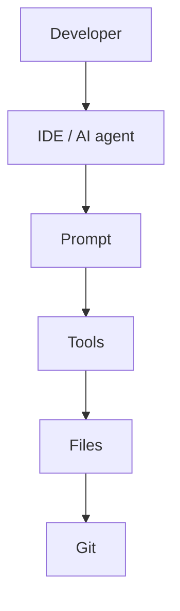

Therefore they are complementary.

### Gateway telemetry

Answers:

> What happened to the LLM request?

### Agent telemetry

Answers:

> What was the developer trying to accomplish and what did the AI agent do?

### Git provenance

Answers:

> What code actually entered the repository?

A complete enterprise AI engineering telemetry system can combine all three.

## Relevance to camer-digital

For an enterprise AI platform such as `camer-digital`, Origin provides a useful architectural
reference.

A combined architecture could look like:

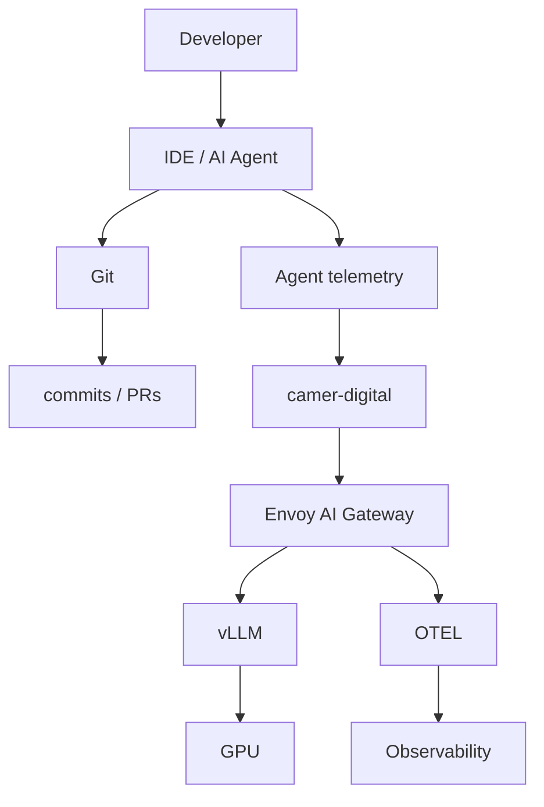

Useful correlation identifiers include:

```text
user_id
session_id
conversation_id
turn_id
agent_id
model
repository
branch
commit_sha
trace_id
```

A shared `turn_id` can connect a developer's prompt to the LLM request observed by the gateway.

This produces an end-to-end lineage:

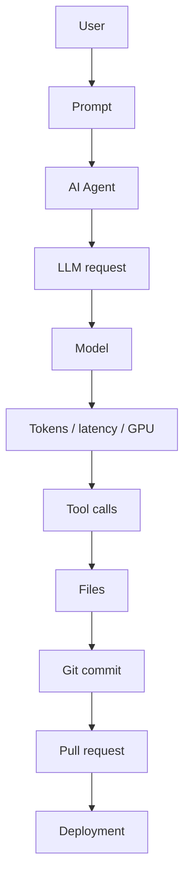

## Key Technologies

At a high level, Origin uses:

- **AI-agent hooks** — receive lifecycle and interaction events.
- **Transcript parsing** — extract prompts, tools, models, tokens, and file activity.
- **Agent adapters** — normalize agent-specific formats.
- **Git** — source of truth for repository state, commits, and diffs.
- **Git notes / refs** — associate AI provenance with Git history.
- **Git blame** — trace source lines back to commits and AI metadata.
- **Background session watching** — monitor active sessions and reconcile transcript changes.
- **Centralized platform services** — provide team dashboards, governance, budgets, audit, and
  organizational visibility.

## Summary

Origin can be understood as an **AI-native layer on top of Git and AI coding agents**.

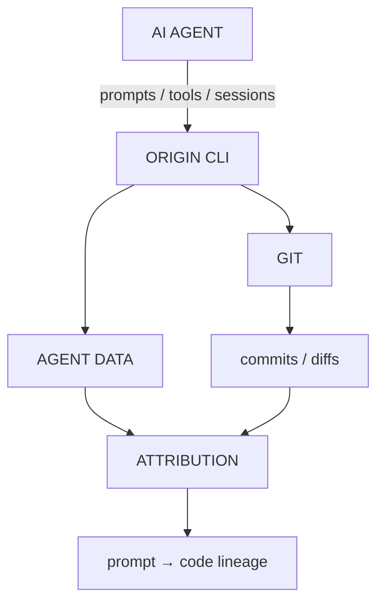

The key innovation is not merely collecting LLM telemetry. It is **connecting AI-agent activity
to the actual Git history of the software being produced**.

For an enterprise AI platform, the main architectural lesson is:

> **Combine agent-side telemetry, LLM gateway telemetry, and Git provenance using shared
> session/turn identifiers.**

That provides a much more complete view of AI-assisted software engineering than any single
telemetry layer.
